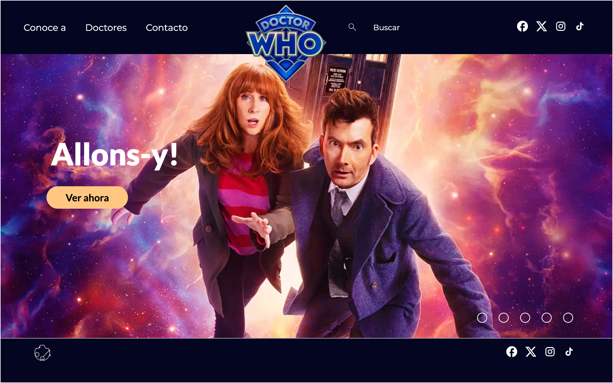
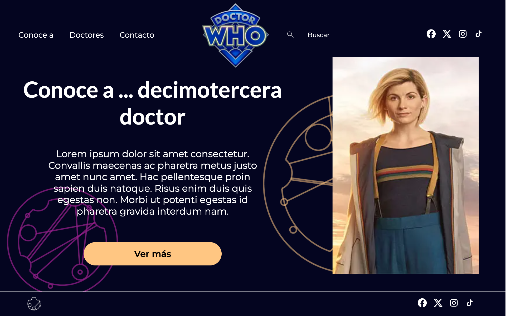
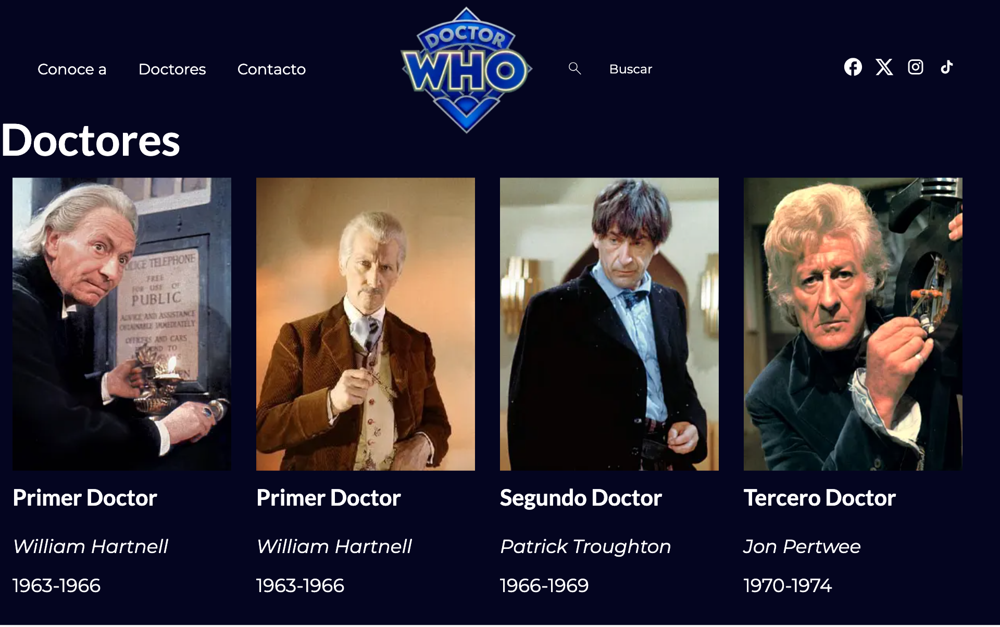
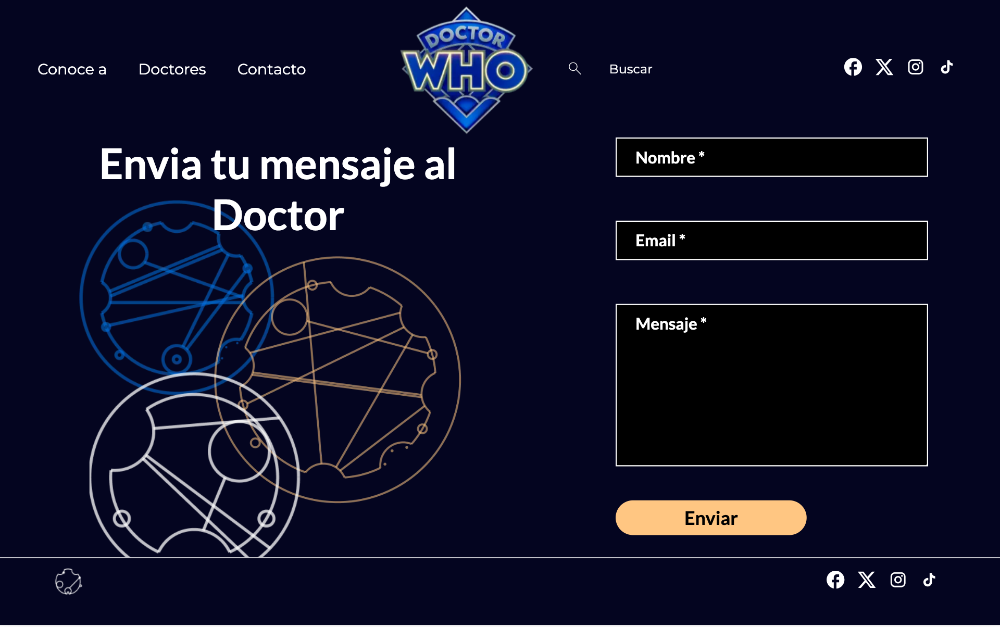

# DOCTOR WHO Website

Welcome! This project resembles a Doctor Who web application as a guide to introduce newbies to the magical world of BBC's most watched and endless tv show, Doctor Who. It was made as a practice project to learn how to make React and Next.js 14 work, as a FactoriaF5 bootcamp exercise.</br>
You can explore and learn about Doctor Who characters and specific and detailed information, find out when their screentime was, and talk to us through a contact page.

## 📓 Challenges 
- Level 3: Create a functional structure app.
- Level 2: Create a dynamic and responsive web user interface.

## Table of Contents
1. Features (#features)
2. Preview (#preview)
3. Technology Used (#technology-used)
4. Installation (#installation)
5. Tools (#tools)
6. Learn More (learn-more)
7. Deploy on Vercel (deploy-on-vercel)

## Features
## Preview

### Homepage

### Get to know... Doctors

### Doctor's List page

### Contact page


## 💻 Technology Used

- 
- 

-  **14.0.4**

## Instalation:

To run this project locally, you will need NodeJS installed on your machine along with npm package.

1. Clone the repository on your computer:

```bash
git clone 'https://github.com/01joanna/DoctorWho-React.git'

2. Get into the project's folder:

```bash
cd drwho-react

3. Install dependencies:

```bash
npm install

4. Run the server:

```bash
npm run dev

Open [http://localhost:3000](http://localhost:3000) with your browser to see the app's contents. The app works on the following operating systems: Windows, Linux and macOS.

## 🛠 Tools
- Visual Studio Code
- Trello 
- Git/Github

- Agile Methodology
- Kanban workspace

**[Mockup](https://www.figma.com/file/rdW0yacdnv7kOhS1CmD9xf/Proyecto-Doctor-Who?type=design&node-id=0%3A1&mode=design&t=huomGaIOBNlk4KvX-1)**

**[doctor-who.zip](https://prod-files-secure.s3.us-west-2.amazonaws.com/18857439-e1b0-4daf-982d-e0d7ded9ff99/2cb59283-e3e3-43c9-99a1-7f2d25c0a500/doctor-who.zip)**

## Learn More about NEXT JS

To learn more about Next.js, take a look at the following resources:

- [Next.js Documentation](https://nextjs.org/docs) - learn about Next.js features and API.
- [Learn Next.js](https://nextjs.org/learn) - an interactive Next.js tutorial.

You can check out [the Next.js GitHub repository](https://github.com/vercel/next.js/) - your feedback and contributions are welcome!

## Deploy on Vercel

The easiest way to deploy your Next.js app is to use the [Vercel Platform](https://vercel.com/new?utm_medium=default-template&filter=next.js&utm_source=create-next-app&utm_campaign=create-next-app-readme) from the creators of Next.js.

Check out our [Next.js deployment documentation](https://nextjs.org/docs/deployment) for more details.
